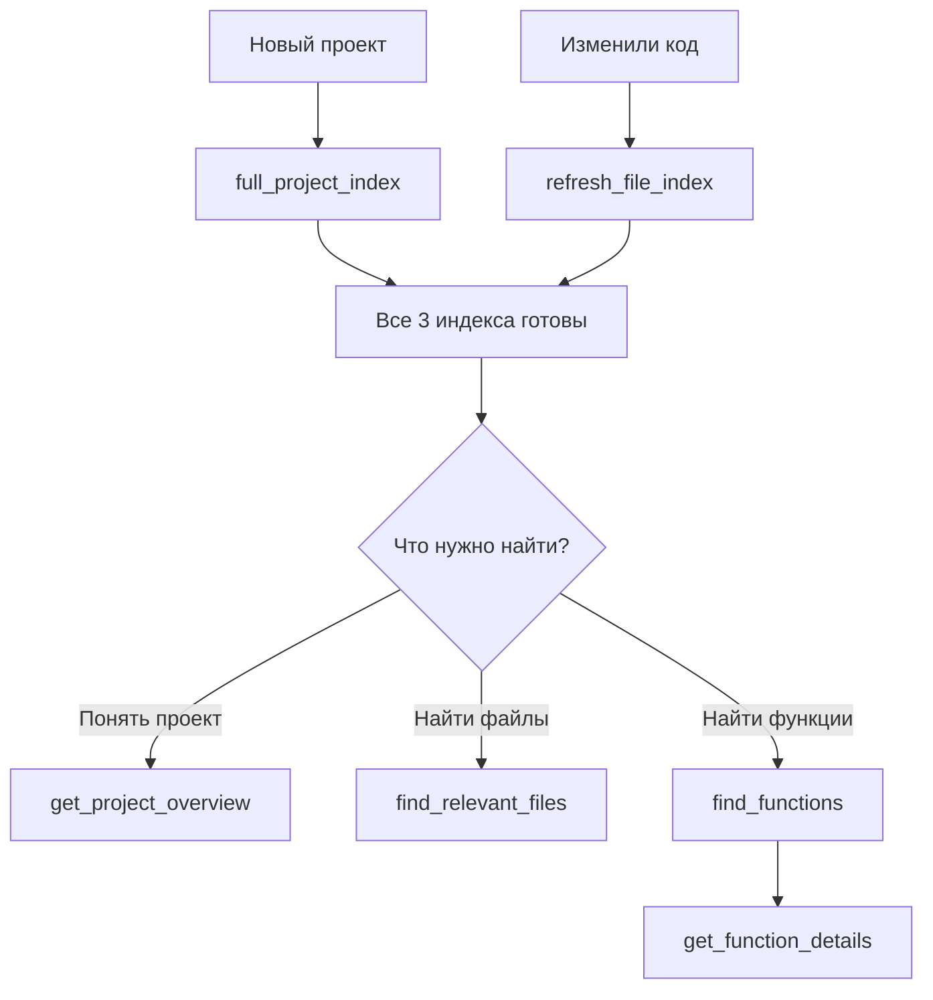

# Project Indexer - MCP Server

Интеллектуальный MCP (Model Context Protocol) сервер для глубокой индексации кодовых проектов. Трёхуровневая система: анализ проекта → индексация файлов → индексация функций. Семантический поиск с AI, ChromaDB и AST-парсинг.

## ✨ Возможности

### 🎯 Трёхуровневая система индексации
- **Index 1**: Итеративный анализ проекта с confidence scores (90%+ точность)
- **Index 2**: Семантическая индексация файлов с контекстом проекта
- **Index 3**: Детальный AST-анализ функций и методов

### 🔍 Интеллектуальный поиск
- 🧠 **Семантический поиск**: По смыслу, а не по ключевым словам
- 📁 **Поиск файлов**: "найди файлы для аутентификации" → auth.py, login.ts
- 🔧 **Поиск функций**: "найди функцию валидации email" → validate_email()
- 📊 **Фильтрация**: По языку, типу файла, классу

### 🤖 AI & Провайдеры
- **Гибкая система провайдеров**: OpenAI, HuggingFace, локальные модели
- **LLM**: GPT-5.2-Codex, GPT-4o, Llama 3.1, Mixtral, CodeLlama
- **Embeddings**: text-embedding-3-small/large, sentence-transformers
- **Custom endpoints**: Поддержка локального деплоя

### ⚡ Производительность & Надёжность
- 🚀 **Параллельная обработка**: До 10 файлов, 5 функций одновременно
- 📝 **Умная разбивка**: Автоматическое chunking больших файлов
- 🔄 **Инкрементальное обновление**: Обновление конкретных файлов без полной реиндексации
- 💾 **Checkpoint система**: Resume после сбоев, не теряя прогресс
- ⏱️ **Rate limiting**: Автоматическое управление лимитами OpenAI API

### 🔧 AST-анализ функций
- **Python**: def, async def, методы, декораторы
- **Kotlin**: fun, suspend fun, extension functions
- **JavaScript/TypeScript**: function, arrow functions, methods
- **Извлечение**: Сигнатуры, параметры, return types, docstrings
- **Анализ**: Назначение, side effects, сложность

## 🛠️ MCP Инструменты (10)

### 📊 Шаг 1: Анализ проекта
1. **`load_project_info`** - Итеративный анализ проекта с confidence scores (tech stack, архитектура, модули)
2. **`get_project_overview`** - Быстрый доступ к кешированному анализу проекта

### 📁 Шаг 2: Индексация файлов
3. **`index_project_files`** - Индексация всех файлов для семантического поиска
4. **`find_relevant_files`** - Семантический поиск файлов по описанию
5. **`refresh_file_index`** - Инкрементальное обновление индекса конкретных файлов

### 🔧 Шаг 3: Индексация функций
6. **`index_project_functions`** - Индексация всех функций и методов (AST-анализ)
7. **`find_functions`** - Семантический поиск функций по описанию
8. **`get_function_details`** - Детальная информация о конкретной функции

### 🚀 Комплексные операции
9. **`check_project_indexes`** - Проверка статуса всех трёх индексов
10. **`full_project_index`** - Автоматическая полная индексация (все 3 шага)

### ⚠️ Цепочка зависимостей (важно!)

```
1. load_project_info (обязательно первым)
   ↓
2. index_project_files (требует #1)
   ↓
3. index_project_functions (требует #1 и #2)
```

**Альтернатива:** Используйте `full_project_index` - выполнит все 3 шага автоматически.

📖 **Полное описание всех инструментов**: [API_REFERENCE.md](API_REFERENCE.md)

## 🎯 Как это работает

### Трёхуровневая система индексации

#### 🔍 **Index 1: Project Analysis** (Итеративный анализ с confidence scores)
**Что делает:**
- Читает README, конфиги (package.json, pyproject.toml, Cargo.toml)
- Сканирует структуру каталогов (src/, lib/, app/)
- Итеративно анализирует проект через LLM
- Строит confidence scores (0-100%) для каждого поля
- Продолжает до достижения 90%+ уверенности

**Результат:**
- Описание проекта
- Языки программирования (Python, TypeScript, Kotlin, etc.)
- Фреймворки (FastAPI, React, Spring Boot, etc.)
- Модули и компоненты
- Entry points (main.py, index.ts, etc.)
- Архитектура (monolithic, microservices, library, CLI, web-app)

#### 📁 **Index 2: File Index** (Семантическая индексация файлов)
**Что делает:**
- Сканирует все исходные файлы проекта
- Анализирует каждый файл через LLM с учётом контекста проекта
- Создаёт семантические embeddings для интеллектуального поиска
- Разбивает большие файлы на chunks
- Сохраняет в ChromaDB для быстрого retrieval

**Пример анализа с контекстом:**
```
Проект: E-commerce API (Django/DRF)
Файл: auth/login.py

Анализ: "JWT authentication для e-commerce API.
Extends DRF's TokenAuthentication и интегрируется
с User model для аутентификации покупателей в
checkout flow."
```

**Включает:**
- Семантический поиск по файлам (`find_relevant_files`)
- Инкрементальное обновление (`refresh_file_index`)

#### 🔧 **Index 3: Function Index** (Детальный анализ функций)
**Что делает:**
- Парсит все файлы через AST (Abstract Syntax Tree)
- Извлекает каждую функцию, метод, класс
- Анализирует через LLM:
  - Назначение функции
  - Входные/выходные параметры
  - Побочные эффекты (DB writes, API calls)
  - Уровень сложности (low/medium/high)
- Создаёт embeddings для каждой функции

**Поддерживаемые языки:**
- Python (def, async def, методы, декораторы)
- Kotlin (fun, suspend fun, extension functions)
- JavaScript/TypeScript, Java, Go, Rust (generic)

**Включает:**
- Поиск функций по описанию (`find_functions`)
- Детальная информация (`get_function_details`)

#### 💾 **Векторное хранилище**
- ChromaDB для хранения embeddings
- Checkpoint system для resume после сбоев
- Раздельные коллекции для файлов и функций
- Метаданные для фильтрации (язык, тип, путь)

### Технологический стек

#### Core
- **Python 3.12** (важно: не 3.14 - ChromaDB несовместим!)
- **MCP SDK** (Model Context Protocol)
- **FastMCP** - фреймворк для MCP серверов
- **ChromaDB** - векторная база данных

#### AI Провайдеры (гибкая система)
**LLM Провайдеры:**
- **OpenAI**: gpt-5.2-codex (рекомендуется), gpt-4o, gpt-4o-mini
- **HuggingFace**: Llama 3.1, Mixtral 8x7B, CodeLlama, Qwen Coder
- **Local**: Любые OpenAI-совместимые модели

**Embedding Провайдеры:**
- **OpenAI**: text-embedding-3-small (рекомендуется), text-embedding-3-large
- **HuggingFace**: all-MiniLM-L6-v2, BGE-base, E5-base, all-mpnet-base-v2
- **Local**: Sentence-transformers модели

#### Функциональность
- **AST Parsing**: Извлечение функций/методов из Python, Kotlin, JS/TS, Java, Go, Rust
- **Checkpoint System**: Resume после сбоев без потери прогресса
- **Rate Limiting**: Автоматическое управление OpenAI API лимитами
- **Iterative Analysis**: Confidence-based анализ проекта (до 90%+ точности)

## 📦 Установка

### 1. Требования

- Python 3.12 (НЕ 3.14! ChromaDB не совместим)
- OpenAI API ключ

**Установка Python 3.12:**
```bash
brew install python@3.12
```

### 2. Клонировать репозиторий

```bash
cd /path/to/your/projects
git clone <repository-url>
cd project-scanner
```

### 3. Создать виртуальное окружение

```bash
# Используйте Python 3.12
/opt/homebrew/bin/python3.12 -m venv venv

# Активировать
source venv/bin/activate

# Проверить версию
python --version  # Должно быть 3.12.x
```

### 4. Установить зависимости

```bash
pip install -r requirements.txt
```

### 5. Настроить конфигурацию

```bash
# Скопировать пример
cp .env.example .env

# Отредактировать и добавить API ключи
nano .env
```

Минимальная конфигурация в `.env`:
```bash
# Провайдеры (по умолчанию - OpenAI)
LLM_PROVIDER=openai
LLM_API_KEY=sk-your-openai-api-key-here
LLM_MODEL=gpt-5.2-codex

EMBEDDING_PROVIDER=openai
# EMBEDDING_API_KEY не нужен - используется LLM_API_KEY
EMBEDDING_MODEL=text-embedding-3-small

# ChromaDB (локальное хранилище)
CHROMA_PERSIST_DIRECTORY=./chroma_data
```

**Альтернативные провайдеры:**
```bash
# HuggingFace
LLM_PROVIDER=huggingface
LLM_API_KEY=hf_your_token
LLM_MODEL=meta-llama/Llama-3.1-70B-Instruct
```

### 6. Проверить установку

```bash
python test_imports.py
```

Должно вывести:
```
✅ All imports successful!
✅ Configuration is valid!
```

## 🚀 Использование

### С Claude Desktop (рекомендуется)

#### 1. Настроить Claude Desktop

Откройте конфигурацию:
```bash
nano ~/Library/Application\ Support/Claude/claude_desktop_config.json
```

Добавьте:
```json
{
  "mcpServers": {
    "project-indexer": {
      "command": "/полный/путь/к/project-scanner/venv/bin/python",
      "args": ["/полный/путь/к/project-scanner/run_server.py"]
    }
  }
}
```

**Важно:** Используйте ПОЛНЫЕ абсолютные пути!

#### 2. Перезапустить Claude Desktop

Полностью закройте и откройте заново.

#### 3. Проверить подключение

В чате спросите:
```
Какие MCP инструменты доступны?
```

Должно показать **project-indexer** с 10 инструментами.

## 🔄 Рабочий процесс

### Типичный сценарий работы



### Когда использовать какой инструмент

| Задача | Инструмент | Пример |
|--------|------------|--------|
| 🆕 Новый проект | `full_project_index` | "Проиндексируй /path/to/project" |
| 📊 Проверка статуса | `check_project_indexes` | "Проверь статус индексации" |
| 🔍 Понять проект | `get_project_overview` | "Что это за проект?" |
| 📁 Найти файлы | `find_relevant_files` | "Где логика аутентификации?" |
| 🔧 Найти функции | `find_functions` | "Найди функцию валидации email" |
| 📋 Детали функции | `get_function_details` | "Покажи детали func_123" |
| 🔄 Обновить код | `refresh_file_index` | "Обнови src/api.py" |
| 🎯 Только файлы | `index_project_files` | После load_project_info |
| ⚙️ Только функции | `index_project_functions` | После index_project_files |

### Примеры использования

#### 1️⃣ Полная индексация нового проекта
```
Проиндексируй проект /Users/john/projects/my-app
```
*Использует `full_project_index` - выполняет все 3 шага автоматически*

#### 2️⃣ Проверка статуса индексов
```
Проверь статус индексации проекта /Users/john/projects/my-app
```
*Использует `check_project_indexes` - показывает что проиндексировано*

#### 3️⃣ Понимание проекта
```
Расскажи что это за проект /Users/john/projects/my-app
```
*Использует `get_project_overview` - возвращает tech stack, архитектуру, модули*

#### 4️⃣ Поиск файлов по описанию
```
Найди файлы которые обрабатывают HTTP запросы
```
```
Где находится логика аутентификации?
```
*Использует `find_relevant_files` - семантический поиск файлов*

#### 5️⃣ Поиск функций
```
Найди функцию которая валидирует email
```
```
Покажи функции которые пишут в базу данных
```
*Использует `find_functions` - семантический поиск на уровне функций*

#### 6️⃣ Детальная информация о функции
```
Покажи полный код и анализ функции с ID func_12345
```
*Использует `get_function_details` - возвращает код, параметры, side effects*

#### 7️⃣ Инкрементальное обновление
```
Обнови индекс для файлов src/api.py и src/config.py
```
*Использует `refresh_file_index` - обновляет только указанные файлы*

#### 8️⃣ Пошаговая индексация (для больших проектов)
```
# Шаг 1: Анализ проекта
Проанализируй проект /Users/john/projects/my-app

# Шаг 2: Индексация файлов
Проиндексируй файлы проекта /Users/john/projects/my-app

# Шаг 3: Индексация функций
Проиндексируй функции проекта /Users/john/projects/my-app
```
*Использует `load_project_info` → `index_project_files` → `index_project_functions`*

## 📊 Стоимость использования

### С gpt-5.2-codex (рекомендуется)

Для проекта из **150 файлов, ~300 функций**:

**Index 1: Project Analysis**
- Итеративный анализ (2-5 итераций): ~$0.05-0.15
- Чтение конфигов и структуры: ~$0.02-0.05

**Index 2: File Index**
- Анализ файлов (150 files × 500 tokens): ~$1.50-2.50
- Embeddings (150 files): ~$0.10-0.20

**Index 3: Function Index**
- AST parsing (бесплатно)
- Анализ функций (300 × 300 tokens): ~$0.90-1.50
- Embeddings (300 functions): ~$0.05-0.10

**Итого полная индексация**: ~$2.62-4.50

**Преимущества gpt-5.2-codex:**
- 🎯 Лучшая точность для кода (+30% vs gpt-4o)
- 🧠 Reasoning capabilities для сложного анализа
- 💰 40-80% экономия через prompt caching
- ⚡ 3% лучше на SWE-bench
- 📊 Confidence scores 90%+ за 2-3 итерации

### Альтернатива: gpt-4o-mini

В ~10 раз дешевле (~$0.25-0.45), но:
- ❌ Хуже понимает код (особенно Kotlin, Rust)
- ❌ Менее точные описания функций
- ❌ Нет reasoning capabilities
- ❌ Confidence scores часто <80%

**Рекомендация:** Используйте gpt-5.2-codex для production проектов.

## 🏗️ Архитектура

### Структура проекта
```
project-scanner/
├── src/
│   ├── server.py              # MCP сервер с 10 инструментами
│   ├── config.py              # Управление конфигурацией
│   │
│   ├── indexer/              # 📊 Система трёхуровневой индексации
│   │   ├── iterative_analyzer.py       # Index 1: Итеративный анализ проекта
│   │   ├── file_index_manager.py       # Index 2: Менеджер индекса файлов
│   │   ├── function_index_manager.py   # Index 3: Менеджер индекса функций
│   │   │
│   │   ├── scanner.py                  # Сканирование файловой системы
│   │   ├── analyzer.py                 # Базовый анализатор файлов
│   │   ├── enhanced_analyzer.py        # Продвинутый анализатор (triggers, layers)
│   │   ├── chunker.py                  # Разбивка больших файлов на chunks
│   │   ├── embedder.py                 # Генерация embeddings
│   │   ├── ast_analyzer.py             # AST парсинг для функций
│   │   ├── context_analyzer.py         # Анализ контекста (legacy)
│   │   ├── trigger_detector.py         # Детекция триггеров (API, DB, events)
│   │   ├── layer_classifier.py         # Классификация архитектурных слоёв
│   │   └── language_adapters.py        # Адаптеры для разных языков
│   │
│   ├── providers/            # 🤖 Система провайдеров AI
│   │   ├── base.py                     # Базовые интерфейсы (LLM, Embedding)
│   │   ├── factory.py                  # Фабрика провайдеров
│   │   ├── openai_provider.py          # OpenAI (GPT-5.2, embeddings)
│   │   └── huggingface_provider.py     # HuggingFace (Llama, sentence-transformers)
│   │
│   ├── storage/              # 💾 Слой хранения данных
│   │   ├── chroma_client.py            # ChromaDB wrapper (векторы)
│   │   ├── checkpoint_manager.py       # Unified checkpoint система
│   │   ├── analysis_repository.py      # Хранилище результатов анализа
│   │   └── models.py                   # Модели данных (AnalysisField, etc.)
│   │
│   └── utils/                # 🛠️ Утилиты
│       ├── file_types.py               # Определение типов файлов
│       ├── logger.py                   # Логирование
│       └── rate_limiter.py             # Rate limiting для OpenAI API
│
├── run_server.py              # 🚀 Точка входа для MCP
├── .env                       # ⚙️ Конфигурация (не в git)
├── requirements.txt           # 📦 Зависимости Python
└── README.md                  # 📖 Этот файл
```

### Поток данных

```
┌─────────────────────────────────────────────────────────────┐
│                     MCP Server (server.py)                  │
│                      10 Tools Available                     │
└──────────────────────┬──────────────────────────────────────┘
                       │
        ┌──────────────┼──────────────┐
        │              │              │
        ▼              ▼              ▼
┌──────────────┐ ┌──────────────┐ ┌──────────────────┐
│   Index 1    │ │   Index 2    │ │    Index 3       │
│   Project    │ │    File      │ │   Function       │
│   Analysis   │ │    Index     │ │    Index         │
└──────┬───────┘ └──────┬───────┘ └────────┬─────────┘
       │                │                   │
       │         ┌──────┴──────┐           │
       │         ▼             ▼           ▼
       │    ┌─────────┐  ┌─────────┐  ┌──────────┐
       │    │ Scanner │  │ Chunker │  │ AST      │
       │    └─────────┘  └─────────┘  │ Analyzer │
       │                               └──────────┘
       │
       └──────────┐
                  ▼
         ┌────────────────┐
         │  LLM Provider  │ ◄──── OpenAI / HuggingFace
         │  (OpenAI etc.) │
         └────────┬───────┘
                  │
                  ▼
         ┌────────────────┐
         │   Embeddings   │
         │    Provider    │
         └────────┬───────┘
                  │
         ┌────────┴────────┐
         ▼                 ▼
┌────────────────┐  ┌──────────────────┐
│   ChromaDB     │  │   Checkpoint     │
│   (Vectors)    │  │   Manager        │
└────────────────┘  └──────────────────┘
```

## 🔧 Конфигурация

### Переменные окружения (.env)

#### Провайдеры AI
```bash
# LLM Provider
LLM_PROVIDER=openai                    # openai | huggingface | local
LLM_API_KEY=sk-your-key-here          # Универсальный ключ
LLM_MODEL=gpt-5.2-codex               # gpt-5.2-codex | gpt-4o | llama-3.1-70b
LLM_REASONING_EFFORT=medium           # low | medium | high

# Embedding Provider
EMBEDDING_PROVIDER=openai              # openai | huggingface | local
EMBEDDING_MODEL=text-embedding-3-small # text-embedding-3-small | bge-base

# Alternative: provider-specific keys
# OPENAI_API_KEY=sk-...
# HUGGINGFACE_TOKEN=hf_...

# Custom endpoints (для локальных моделей)
# LLM_BASE_URL=http://localhost:8080/v1
# EMBEDDING_BASE_URL=http://localhost:8081/v1
```

#### ChromaDB
```bash
# Local persistent storage (default)
CHROMA_PERSIST_DIRECTORY=./chroma_data

# Or remote ChromaDB server
# CHROMA_HOST=localhost
# CHROMA_PORT=8000
```

#### Индексация & Производительность
```bash
# File processing
MAX_FILE_SIZE_MB=1.0
MAX_CHUNK_SIZE_TOKENS=6000
CHUNK_OVERLAP_TOKENS=500

# Concurrency settings (3-index system)
MAX_CONCURRENT_FILES=10               # Index 2: File indexing parallelism
MAX_CONCURRENT_FUNCTIONS=5            # Index 3: Function analysis parallelism
MAX_CONCURRENT_AST_PARSING=10         # Index 3: AST parsing threads
MAX_CONCURRENT_LLM_BATCHES=5          # LLM enrichment batches

# Rate limiting (OpenAI API)
RATE_LIMIT_RPM=3500                   # Requests per minute
RATE_LIMIT_TPM=1000000                # Tokens per minute
```

#### Сервер
```bash
LOG_LEVEL=INFO                        # DEBUG | INFO | WARNING | ERROR
SERVER_NAME=project-indexer
SERVER_VERSION=1.0.0
```

### Поддерживаемые файлы и языки

#### Индексируемые типы файлов (config.yaml)

**Код (с полным AST-анализом для функций):**
- Python: `.py`
- JavaScript/TypeScript: `.js`, `.ts`, `.tsx`, `.jsx`
- Kotlin: `.kt`
- Java: `.java`
- Go: `.go`
- Rust: `.rs`
- C/C++: `.c`, `.cpp`, `.h`
- Other: `.php`, `.rb`, `.swift`, `.scala`

**Конфигурация и данные:**
- `.yaml`, `.yml`, `.json`, `.toml`, `.xml`

**Документация:**
- `.md`, `.rst`, `.txt`

#### Автоматически исключаются
```
node_modules/, venv/, .venv/, env/, __pycache__/, .git/
dist/, build/, .next/, .cache/, coverage/
*.min.js, *.min.css, *.lock, package-lock.json
yarn.lock, poetry.lock
```

#### Бинарные файлы (игнорируются)
```
.png, .jpg, .jpeg, .gif, .pdf, .zip, .tar, .gz
.ico, .woff, .woff2, .ttf, .eot, .pyc
```

## 🐛 Troubleshooting

### "Error 429 - insufficient_quota"

Закончились деньги на OpenAI API.

**Решение:**
1. Добавьте средства: https://platform.openai.com/account/billing
2. Проверьте лимиты: https://platform.openai.com/account/limits

### "ModuleNotFoundError: No module named 'src'"

**Решение:**
Используйте `run_server.py` вместо прямого запуска:
```bash
# ✅ Правильно
python run_server.py

# ❌ Неправильно
python -m src.server
```

### Python 3.14 проблемы с ChromaDB

ChromaDB не совместим с Python 3.14.

**Решение:**
См. [SETUP_PYTHON312.md](SETUP_PYTHON312.md)

### MCP сервер не загружается

**Проверьте:**
1. Полные абсолютные пути в конфигурации
2. Python 3.12 используется: `venv/bin/python --version`
3. Логи Claude Desktop: `tail -f ~/Library/Logs/Claude/mcp*.log`

## 📚 Дополнительная документация

- **[API_REFERENCE.md](API_REFERENCE.md)** - Полное описание всех 8 инструментов
- **[CLAUDE_DESKTOP_CONFIG.md](CLAUDE_DESKTOP_CONFIG.md)** - Детальная настройка Claude Desktop
- **[IMPLEMENTATION_SUMMARY.md](IMPLEMENTATION_SUMMARY.md)** - Технические детали реализации
- **[SETUP_PYTHON312.md](SETUP_PYTHON312.md)** - Решение проблем с Python версией
- **[QUICKSTART.md](QUICKSTART.md)** - Быстрый старт

## 🤝 Contributing

Буду рад вашим предложениям и pull requests!

## 📄 Лицензия

MIT License

## 🔗 Ссылки

- [Model Context Protocol](https://modelcontextprotocol.io)
- [OpenAI API](https://platform.openai.com/docs)
- [ChromaDB](https://www.trychroma.com/)
- [Claude Desktop](https://claude.ai/download)

---

**Версия:** 2.0.0 | **Дата:** 2026-02-06 | **Python:** 3.12+ | **Система:** 3-Level Indexing | **API:** GPT-5.2-Codex
